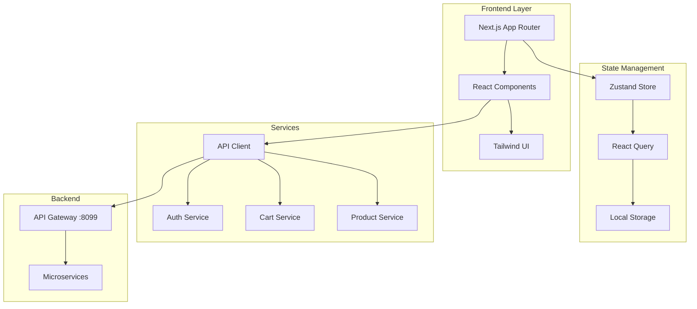

# 🛒 NexusCommerce Frontend

[](https://nextjs.org/)
[](https://reactjs.org/)
[](https://www.typescriptlang.org/)
[](https://tailwindcss.com/)
[](https://opensource.org/licenses/MIT)

> **Modern E-Commerce Experience** - A cutting-edge, responsive e-commerce web application built with Next.js 14, featuring advanced state management, real-time synchronization, and seamless user experience.

## ✨ Features

### 🛍️ **Shopping Experience**
- **Smart Product Catalog** with advanced filtering, search, and categorization
- **Intelligent Cart** with real-time sync for guest and authenticated users
- **Wishlist Management** with availability tracking
- **Product Discovery** with recommendations and detailed reviews
- **Responsive Design** optimized for all devices

### 👤 **User Management**
- **Secure Authentication** with JWT and OAuth2 (Google) integration
- **Profile Management** for personal information and preferences
- **Order Tracking** with complete history and status updates
- **Loyalty Program** with points, tiers, and rewards
- **Real-time Notifications** for orders and promotions

### 💳 **Checkout & Payments**
- **Multi-step Checkout** with address, shipping, and payment
- **Multiple Payment Methods** including credit cards and digital wallets
- **Shipping Integration** with real-time rates and tracking
- **Secure Processing** with PCI compliance
- **Order Management** with invoices and returns

### 🎨 **User Interface**
- **Dark/Light Mode** with system preference detection
- **Smooth Animations** powered by Framer Motion
- **Accessibility** WCAG compliant with keyboard navigation
- **Modern Design** with clean, conversion-optimized UI
- **Performance Optimized** with advanced caching and rendering

## 🛠️ Technology Stack

<div align="center">

| **Frontend Core** | **State Management** | **UI/UX** | **Development** |
|:---:|:---:|:---:|:---:|
| Next.js 14 | Zustand | Tailwind CSS | TypeScript |
| React 18 | React Query | Radix UI | ESLint |
| TypeScript | React Hook Form | Framer Motion | Prettier |
| | | Lucide React | Husky |

</div>

### **Backend Integration**
- **API Gateway** (Port 8099) for load-balanced microservices
- **Microservices Architecture** for user, product, cart, order, payment, shipping, loyalty, and notification services
- **JWT Authentication** with refresh token management
- **Real-time WebSocket** connections for live updates

## 🏗️ Architecture Overview



## 🚀 Quick Start

### Prerequisites
- **Node.js** 18+ 
- **npm** or **yarn**
- **Git**

### Installation

1. **Clone the repository**
   ```bash
   git clone https://github.com/ZakariaRek/Ecommerce-App.git
   cd Ecommerce-App/frontend
   ```

2. **Install dependencies**
   ```bash
   npm install
   # or
   yarn install
   ```

3. **Environment setup**
   ```bash
   cp .env.example .env.local
   ```
   
   Update `.env.local`:
   ```env
   NEXT_PUBLIC_API_URL=http://localhost:8099/api
   NEXT_PUBLIC_APP_URL=http://localhost:3000
   NEXTAUTH_SECRET=your-secret-key
   NEXTAUTH_URL=http://localhost:3000
   ```

4. **Start development server**
   ```bash
   npm run dev
   ```

5. **Open application**
   Navigate to [http://localhost:3000](http://localhost:3000)

## 📱 Component Architecture

Our component system follows atomic design principles:

### **Design System**
```typescript
// Design tokens and theming
const theme = {
  colors: { /* color palette */ },
  typography: { /* font system */ },
  spacing: { /* spacing scale */ },
  breakpoints: { /* responsive breakpoints */ }
}
```

### **Component Hierarchy**
- **Primitives**: Button, Input, Card, Dialog
- **Composites**: ProductCard, CartItem, CheckoutForm
- **Pages**: ProductList, ProductDetail, Cart, Checkout
- **Layouts**: Header, Footer, Sidebar, Navigation

### **Example: Product Card Component**
```typescript
interface ProductCardProps {
  product: ProductSummary;
  onAddToCart: (productId: string) => Promise<void>;
  onAddToWishlist: (productId: string) => void;
}

export function ProductCard({ product, onAddToCart, onAddToWishlist }: ProductCardProps) {
  return (
    <motion.div
      whileHover={{ scale: 1.02 }}
      className="group relative bg-white rounded-lg shadow-sm hover:shadow-md transition-all"
    >
      {/* Product image, info, and actions */}
    </motion.div>
  );
}
```

## 🔄 State Management

### **Zustand Global State**
- **User State**: Authentication, profile, preferences
- **Cart State**: Items, totals, sync status
- **UI State**: Theme, modals, notifications
- **Saved Items**: Wishlist management

### **React Query Server State**
- **Products**: Catalog, search, filters
- **Orders**: History, status, tracking
- **Reviews**: Ratings and comments
- **Real-time**: Live notifications

### **Hybrid Cart System**
```typescript
// Seamless guest-to-authenticated user cart sync
const syncCart = async (localCart: CartItem[], userId: string) => {
  const response = await api.post('/cart/sync', {
    localItems: localCart,
    userId,
    mergeStrategy: 'SUM_QUANTITIES'
  });
  return response.data;
};
```

## 🎨 Responsive Design

### **Breakpoints**
- **XS**: 0-479px (Mobile Portrait)
- **SM**: 480-767px (Mobile Landscape)  
- **MD**: 768-1023px (Tablet)
- **LG**: 1024-1279px (Desktop)
- **XL**: 1280px+ (Large Desktop)

### **Mobile-First Approach**
```css
/* Base styles for mobile */
.product-grid {
  @apply grid grid-cols-1 gap-4;
}

/* Tablet and up */
@screen md {
  .product-grid {
    @apply grid-cols-2 gap-6;
  }
}

/* Desktop and up */
@screen lg {
  .product-grid {
    @apply grid-cols-3 gap-8;
  }
}
```

## 🔐 Authentication Flow

### **Multiple Authentication Methods**
- **Email/Password** with secure validation
- **OAuth2 Google** integration
- **JWT Tokens** with automatic refresh
- **Session Management** with secure cookies

### **Authentication States**
```typescript
interface AuthState {
  user: User | null;
  isAuthenticated: boolean;
  isLoading: boolean;
  error: string | null;
}
```

## 🎯 Available Scripts

```bash
# Development
npm run dev          # Start development server
npm run build        # Build for production
npm run start        # Start production server

# Code Quality
npm run lint         # Run ESLint
npm run lint:fix     # Fix ESLint issues
npm run type-check   # TypeScript checking

# Testing
npm run test         # Run tests
npm run test:watch   # Run tests in watch mode
npm run test:coverage # Generate coverage report

# Deployment
npm run deploy       # Deploy to Vercel
```

## 🚀 Deployment

### **Vercel (Recommended)**
```bash
npm install -g vercel
vercel login
vercel
```

### **Docker**
```dockerfile
FROM node:18-alpine AS deps
WORKDIR /app
COPY package*.json ./
RUN npm ci --only=production

FROM node:18-alpine AS runner
# ... (production configuration)
EXPOSE 3000
CMD ["npm", "start"]
```

### **Environment Variables**

#### Development
```env
NEXT_PUBLIC_API_URL=http://localhost:8099/api
NEXT_PUBLIC_APP_URL=http://localhost:3000
NEXTAUTH_SECRET=development-secret
NEXT_PUBLIC_DEBUG_MODE=true
```

#### Production
```env
NEXT_PUBLIC_API_URL=https://api.nexuscommerce.io/api
NEXT_PUBLIC_APP_URL=https://nexuscommerce.io
NEXTAUTH_SECRET=production-secret-very-secure
NEXT_PUBLIC_DEBUG_MODE=false
```

## 🧪 Testing Strategy

### **Unit Testing**
```typescript
// Component testing with React Testing Library
import { render, screen, fireEvent } from '@testing-library/react';

describe('ProductCard', () => {
  it('renders product information correctly', () => {
    render(<ProductCard product={mockProduct} />);
    expect(screen.getByText('Test Product')).toBeInTheDocument();
  });
});
```

### **E2E Testing**
```typescript
// Playwright end-to-end tests
test('complete shopping flow', async ({ page }) => {
  await page.goto('/');
  await page.click('[data-testid="add-to-cart"]');
  await page.click('[data-testid="checkout"]');
  // ... complete flow testing
});
```

## 📊 Performance Optimization

### **Next.js Optimizations**
- **Image Optimization** with next/image
- **Dynamic Imports** for code splitting
- **Route Prefetching** for faster navigation
- **Bundle Analysis** for size monitoring

### **Runtime Performance**
- **React Query Caching** for server state
- **Zustand Persistence** for client state
- **Service Worker** for offline functionality
- **CDN Integration** for static assets

## 📱 Progressive Web App (PWA)

### **PWA Features**
- **Offline Support** with service worker caching
- **Install Prompt** for native app experience
- **Background Sync** for pending operations
- **Push Notifications** for order updates

### **Offline Cart Sync**
```typescript
// Queue operations when offline
const useOfflineSync = () => {
  const [pendingOperations, setPendingOperations] = useState([]);
  
  const syncWhenOnline = async () => {
    for (const operation of pendingOperations) {
      await operation.execute();
    }
  };
  
  return { syncWhenOnline };
};
```

## 🤝 Contributing

We welcome contributions! Please follow our contribution guidelines:

### **Development Workflow**
1. Fork the repository
2. Create feature branch: `git checkout -b feature/amazing-feature`
3. Install dependencies: `npm install`
4. Make changes with proper testing
5. Run tests: `npm run test`
6. Commit: `git commit -m 'Add amazing feature'`
7. Push: `git push origin feature/amazing-feature`
8. Create Pull Request

### **Code Standards**
- **ESLint** configuration for code quality
- **Prettier** for consistent formatting
- **TypeScript** for type safety
- **Conventional Commits** for clear history

## 📄 License

This project is licensed under the **MIT License** - see the [LICENSE](LICENSE) file for details.

## 🔗 Links & Resources

- 🌐 **Live Demo**: [https://nexuscommerce-demo.vercel.app](https://nexuscommerce-demo.vercel.app)
- 📚 **Documentation**: [https://docs.nexuscommerce.io](https://docs.nexuscommerce.io)
- 🐛 **Issues**: [GitHub Issues](https://github.com/ZakariaRek/Ecommerce-App/issues)
- 💬 **Discussions**: [GitHub Discussions](https://github.com/ZakariaRek/Ecommerce-App/discussions)

## 🙏 Acknowledgments

- **Next.js Team** for the amazing React framework
- **Vercel** for hosting and deployment platform
- **Tailwind CSS** for utility-first CSS framework
- **Open Source Community** for incredible libraries and tools

---

<div align="center">

**Built with ❤️ by the NexusCommerce Team**

⭐ **Star us on GitHub if this project helped you!**

</div>
